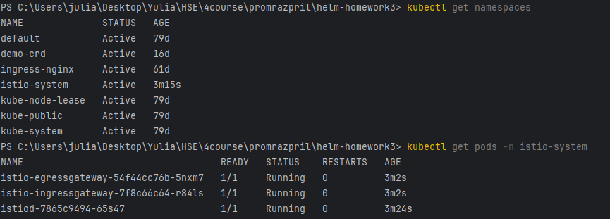
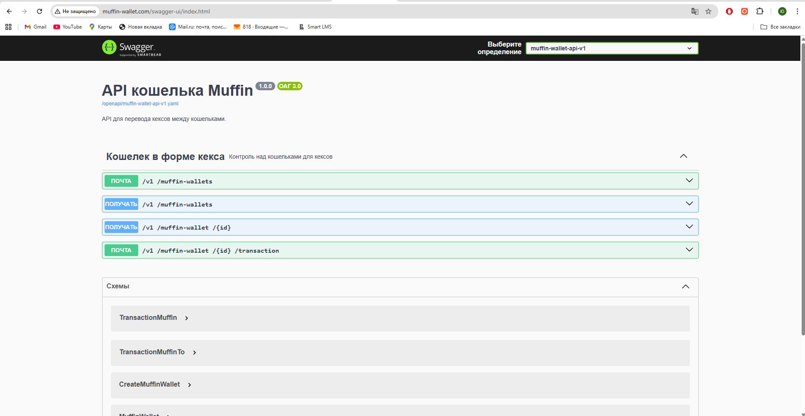
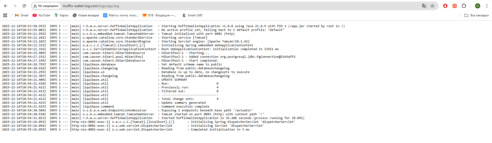

# ДЗ 1 по Istio. Промышленное развертывание промышленных приложений.

## Выполнила Кухтина Юлия Егоровна, БПИ224

## Выполненные шаги

### 1. Установила Istio
скачала отсюда архив `https://github.com/istio/istio/releases/tag/1.28.1`, распаковала, добавила в path папку `bin`
```
istioctl install --set profile=demo -y --set meshConfig.outboundTrafficPolicy.mode=REGISTRY_ONLY # установка, REGISTRY_ONLY нужно, чтобы не было доступа вовне из кластера
kubectl label namespace default istio-injection=enabled # включить инъекцию сайдкара для namespace default
```


### 2. Создала helmfile.yaml
```
releases:
  - name: currency
    namespace: default
    chart: ./muffin-currency-chart
    values:
      - ./muffin-currency-chart/values.yaml

  - name: wallet
    namespace: default
    chart: ./muffin-wallet-chart
    values:
      - ./muffin-wallet-chart/values.yaml
```

запуск:
```
helm sync
```
### 3. Настройка Ingress Gateway
3.1. Включила туннелирование
```
minikube tunnel
```
3.2. Создала Gateway + Virtual Service
```
apiVersion: networking.istio.io/v1alpha3
kind: Gateway
metadata:
  name: wallet-gateway
spec:
  selector:
    istio: ingressgateway
  servers:
    - port:
        number: 80
        name: http
        protocol: HTTP
      hosts:
        - "muffin-wallet.com"
        - "muffin-wallet-log.com"
```
```
apiVersion: networking.istio.io/v1alpha3
kind: VirtualService
metadata:
  name: wallet-vs
spec:
  hosts:
    - "muffin-wallet.com"
    - "muffin-wallet-log.com"
  gateways:
    - wallet-gateway
  http:
    - match:
        - uri:
            prefix: /
          authority:
            exact: muffin-wallet.com
      route:
        - destination:
            host: wallet-muffin-wallet
            port:
              number: 80
    - match:
        - uri:
            prefix: /
          authority:
            exact: muffin-wallet-log.com
      route:
        - destination:
            host: wallet-muffin-wallet-log
            port:
              number: 80
```
Таким образом, трафик на `muffin-wallet.com` идет на сервис `wallet-muffin-wallet` порт 80, а трафик с `muffin-wallet-log.com` идет на сервис `wallet-muffin-wallet-log` порт 80



### 4. Настройка Service Entry и Virtual Service между микросервисами
```
apiVersion: networking.istio.io/v1alpha3
kind: ServiceEntry
metadata:
  name: external-postgres
spec:
  hosts:
    - host.minikube.internal
  ports:
    - number: 5432
      name: postgres
      protocol: TCP
  location: MESH_EXTERNAL
  resolution: DNS
```
```
apiVersion: networking.istio.io/v1alpha3
kind: VirtualService
metadata:
  name: muffin-currency-vs
spec:
  hosts:
    - muffin-currency
  http:
    - route:
        - destination:
            host: muffin-currency
            port:
              number: 8083
```


### Полезные команды
Попасть внутрь контейнера приложения и исполнить запрос к currency
```
kubectl exec -it wallet-muffin-wallet-6f89874666-4vcpq -c muffin-wallet -- /bin/sh
wget -S -O- "http://muffin-currency:8083/rate?from=PLAIN&to=CHOKOLATE"
```


kubectl apply -f https://raw.githubusercontent.com/istio/istio/release-1.28/samples/addons/prometheus.yaml
kubectl apply -f https://raw.githubusercontent.com/istio/istio/release-1.28/samples/addons/kiali.yaml
kubectl apply -f https://raw.githubusercontent.com/istio/istio/release-1.28/samples/addons/jaeger.yaml
kubectl apply -f https://raw.githubusercontent.com/istio/istio/release-1.28/samples/addons/grafana.yaml

istioctl dashboard kiali
http://localhost:20001/kiali/console/overview

istioctl dashboard prometheus
http://localhost:9090

istio_requests_total

istioctl dashboard grafana
http://localhost:3000


