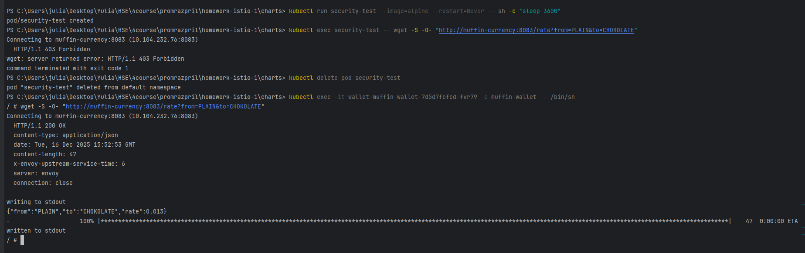
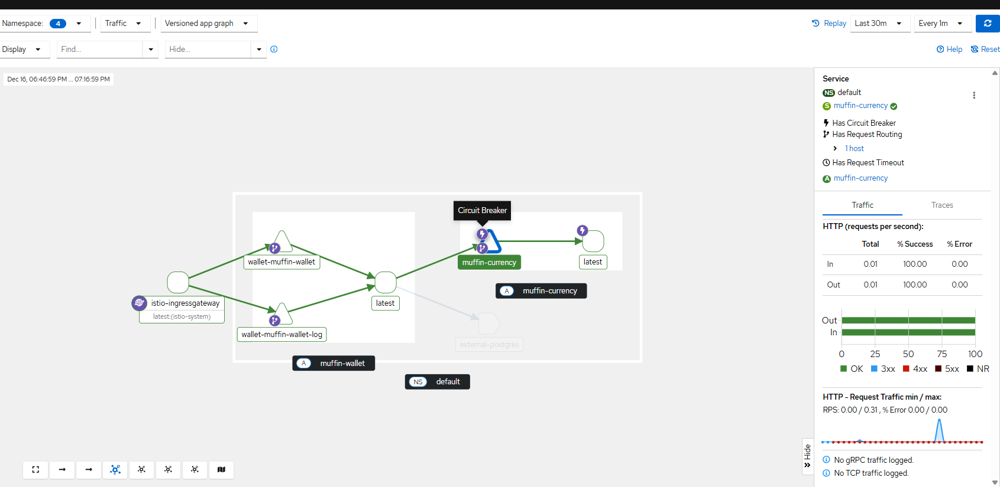
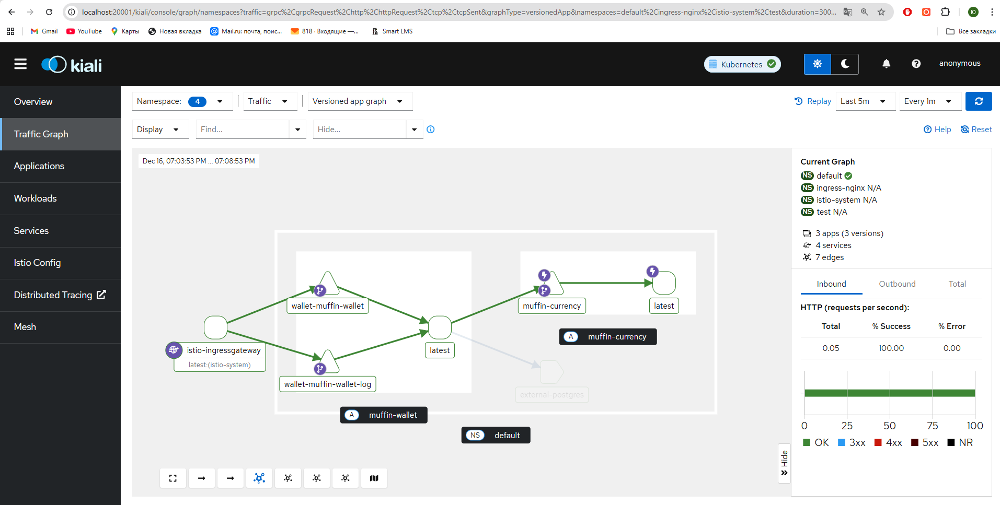
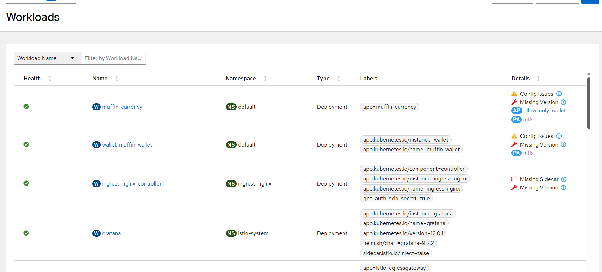
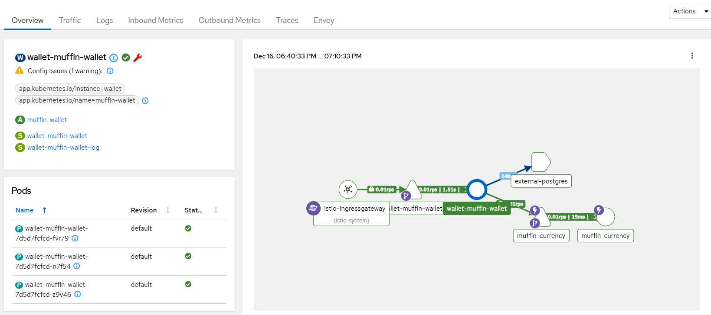
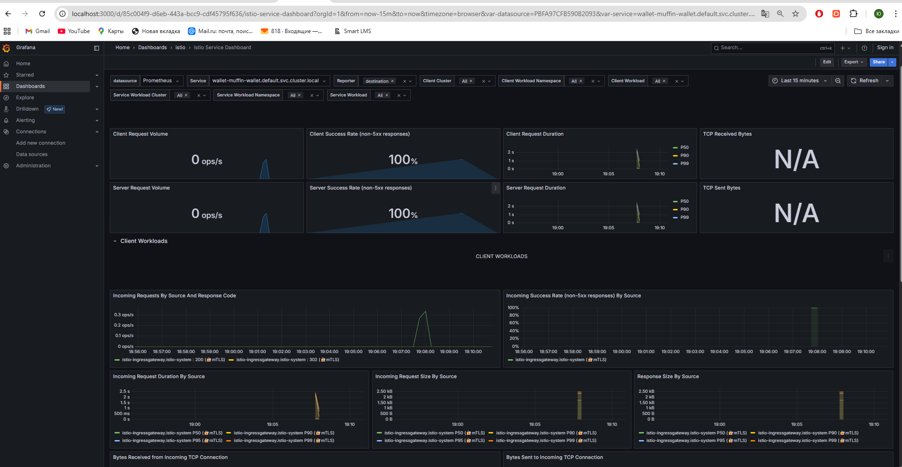
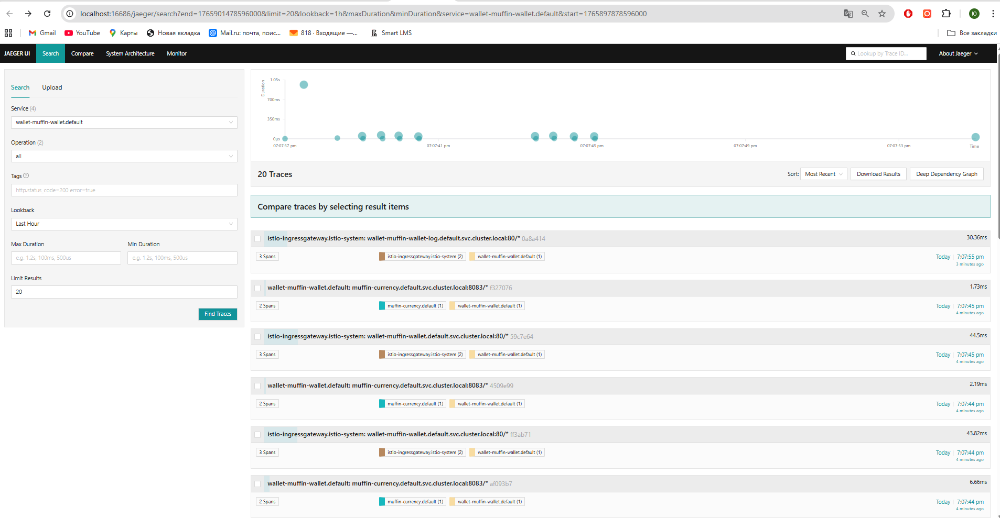
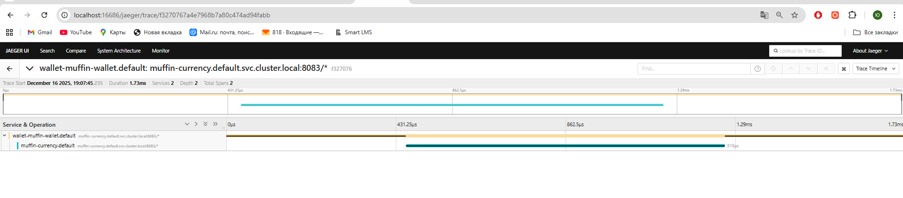

# ДЗ 1 по Istio. Промышленное развертывание промышленных приложений.

## Выполнила Кухтина Юлия Егоровна, БПИ224

#### хосты для сваггера и логов:

```
http://muffin-wallet.com/
http://muffin-wallet-log.com/logs
```

#### метрики:
```
istioctl dashboard jaeger
istioctl dashboard grafana
istioctl dashboard kiali
```

## Выполненные шаги

### 1. Установила Istio
скачала отсюда архив `https://github.com/istio/istio/releases/tag/1.28.1`, распаковала, добавила в path папку `bin`
```
istioctl install --set profile=demo -y --set meshConfig.outboundTrafficPolicy.mode=REGISTRY_ONLY # установка, REGISTRY_ONLY нужно, чтобы не было доступа вовне из кластера
kubectl label namespace default istio-injection=enabled # включить инъекцию сайдкара для namespace default
```


```
minikube start --cpus=4 --memory=6g  --driver=docker
```

### 2. Создала helmfile.yaml
```
releases:
  - name: currency
    namespace: default
    chart: ./muffin-currency-chart
    values:
      - ./muffin-currency-chart/values.yaml

  - name: wallet
    namespace: default
    chart: ./muffin-wallet-chart
    values:
      - ./muffin-wallet-chart/values.yaml

  - name: istio
    namespace: default
    chart: ./muffin-istio-chart
    values:
      - ./muffin-istio-chart/values.yaml
```

запуск:
```
helmfile sync # синхронизировать с манифестами
helmfile destroy # удалить
helmfile template # посмотреть результат генерации манифестов
```
### 3. Настройка Ingress Gateway
3.1. Включила туннелирование
```
minikube tunnel
```
3.2. Создала Gateway + Virtual Service
```
apiVersion: networking.istio.io/v1alpha3
kind: Gateway
metadata:
  name: wallet-gateway
spec:
  selector:
    istio: ingressgateway
  servers:
    - port:
        number: 80
        name: http
        protocol: HTTP
      hosts:
        - "muffin-wallet.com"
        - "muffin-wallet-log.com"
```
```
apiVersion: networking.istio.io/v1alpha3
kind: VirtualService
metadata:
  name: wallet-vs
spec:
  hosts:
    - "muffin-wallet.com"
    - "muffin-wallet-log.com"
  gateways:
    - wallet-gateway
  http:
    - match:
        - uri:
            prefix: /
          authority:
            exact: muffin-wallet.com
      route:
        - destination:
            host: wallet-muffin-wallet
            port:
              number: 80
    - match:
        - uri:
            prefix: /
          authority:
            exact: muffin-wallet-log.com
      route:
        - destination:
            host: wallet-muffin-wallet-log
            port:
              number: 80
```
Таким образом, трафик на `muffin-wallet.com` идет на сервис `wallet-muffin-wallet` порт 80, а трафик с `muffin-wallet-log.com` идет на сервис `wallet-muffin-wallet-log` порт 80


### 4. Настройка Service Entry и Virtual Service между микросервисами
```
apiVersion: networking.istio.io/v1alpha3
kind: ServiceEntry
metadata:
  name: external-postgres
spec:
  hosts:
    - host.minikube.internal
  ports:
    - number: 5432
      name: postgres
      protocol: TCP
  location: MESH_EXTERNAL
  resolution: DNS
```
```
apiVersion: networking.istio.io/v1alpha3
kind: VirtualService
metadata:
  name: muffin-currency-vs
spec:
  hosts:
    - muffin-currency
  http:
    - route:
        - destination:
            host: muffin-currency
            port:
              number: 8083
```

### 5. Настройка безопасности в кластере
5.1. Изменить настройка истио по доступу вовне (уже сделали при установке) \
5.2. Включить mTLS в неймспейсе
```
apiVersion: security.istio.io/v1beta1
kind: PeerAuthentication
metadata:
  name: mtls
  namespace: default
spec:
  mtls:
    mode: STRICT
```
5.3. Даем доступ только muffin-wallet к muffin-currency с помощью создания Service Account и AuthorizationPolicy
```
apiVersion: v1
kind: ServiceAccount
metadata:
  name: muffin-wallet-sa # он прописывается в деплойменте muffin-wallet
  namespace: default

apiVersion: security.istio.io/v1beta1
kind: AuthorizationPolicy
metadata:
  name: allow-only-wallet
  namespace: default
spec:
  selector:
    matchLabels:
      app: muffin-currency
  action: ALLOW
  rules:
    - from:
        - source:
            principals: ["cluster.local/ns/default/sa/muffin-wallet-sa"]
```

### 

проверяем:
```
kubectl run security-test --image=alpine --restart=Never -- sh -c "sleep 3600"
kubectl exec security-test -- wget -S -O- "http://muffin-currency:8083/rate?from=PLAIN&to=CHOKOLATE"
kubectl delete pod security-test
```


### 6. Устойчивость
Настроить Circuit Breaker и Retry для устойчивости к сбоям.
Настроила на muffin-currency:
* ретраи:
```
apiVersion: networking.istio.io/v1alpha3
kind: VirtualService
metadata:
  name: muffin-currency-vs
  namespace: default
spec:
  hosts:
    - muffin-currency
  http:
    - route:
        - destination:
            host: muffin-currency
            port:
              number: 8083
      retries:
        attempts: 3
        perTryTimeout: 2s
        retryOn: connect-failure,refused-stream,unavailable,deadline-exceeded,resource-exhausted,5xx
      timeout: 10s
```
```
apiVersion: networking.istio.io/v1beta1
kind: DestinationRule
metadata:
  name: muffin-currency-cb
  namespace: default
spec:
  host: muffin-currency.default.svc.cluster.local
  trafficPolicy:
    connectionPool:
      tcp:
        maxConnections: 20
      http:
        http1MaxPendingRequests: 5
        maxRequestsPerConnection: 5
        maxRetries: 3
    outlierDetection:
      consecutive5xxErrors: 7
      interval: 5s
      baseEjectionTime: 15s
      maxEjectionPercent: 100
```


### 7. Метрики и дашборды
```
kubectl apply -f https://raw.githubusercontent.com/istio/istio/release-1.28/samples/addons/prometheus.yaml
kubectl apply -f https://raw.githubusercontent.com/istio/istio/release-1.28/samples/addons/kiali.yaml
kubectl apply -f https://raw.githubusercontent.com/istio/istio/release-1.28/samples/addons/jaeger.yaml
kubectl apply -f https://raw.githubusercontent.com/istio/istio/release-1.28/samples/addons/grafana.yaml
```
```
kubectl edit configmap kiali -n istio-system
```
прописываем
```
tracing:
  enabled: true
  in_cluster_url: http://jaeger-query.istio-system:16686
  use_grpc: false
```
```
kubectl rollout restart deployment/kiali -n istio-system
```
```
apiVersion: telemetry.istio.io/v1
kind: Telemetry
metadata:
  name: mesh-default
  namespace: istio-system
spec:
  tracing:
  - providers:
    - name: jaeger
```

проверяем
```
istioctl dashboard kiali
http://localhost:20001/kiali/console/overview

istioctl dashboard jaeger

istioctl dashboard prometheus
http://localhost:9090

istio_requests_total

istioctl dashboard grafana
http://localhost:3000
```







### Полезные команды
Попасть внутрь контейнера приложения и исполнить запрос к currency
```
kubectl exec -it wallet-muffin-wallet-6f89874666-4vcpq -c muffin-wallet -- /bin/sh
wget -S -O- "http://muffin-currency:8083/rate?from=PLAIN&to=CHOKOLATE"
```

